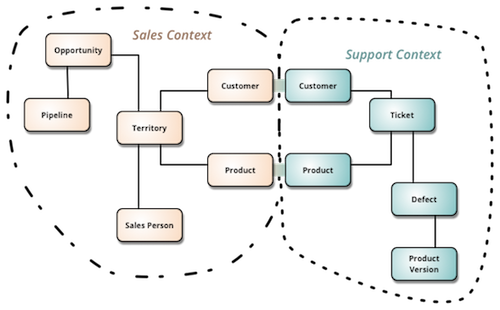
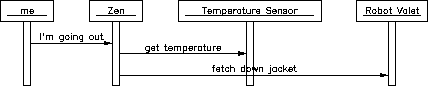
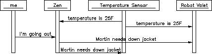

title: "Konnektid: Beyond"
controls: false
progress: true
theme: ../cleaver-theme-konnektid

---

# Konnektid: Beyond
## Introduction to our (future) platform architecture


---

### Overview

- Domain Driven Design (DDD)
- Microservices
- Event Sourcing (ES)
    - Eventual consistency
- CQRS
- Event Collaboration
- Konnektid architecture

---

### Domain Driven Design (DDD)

- Software development process
- Bounded Context
- Business domain / Teams



---

### Microservice Architecture

- Monolithic application
- Multiple (smaller) services
    - Clear boundaries / responsibility
    - Deployment / Scalability
    - Technology diversity
- Remote procedure calls (RPC)
    - Message queue / Service bus
    - Unavailability

---

### Event Sourcing (ES)

- Storing **events** rather than current **state**
    - Immutable event log
    - Single *source of truth*
- Replay events to calculate state: **reducer**
- Time travel! 😎
    - Check old application state
    - Fix bugs retroactively
    - New analytics

---

#### Implementation
- Aggregate / Event Stream (ID)
- Command: validation of state & emit event(s)
- Event: *always* succeeds, is *pure* and *never* deleted

```js
const applyCommand = function (state, command) {

    if (!isValid(state))
        throw new Error("Nope :(");

    return [event, ...];
}

// Similar to Redux!
const applyEvent = (state, event) => newState;
```

---

#### Limitations

- Aggregate only sees own state
- Can only query by ID

#### Read models (projections)

- Reducer for **all** events (cross-domain)
- Tailored to UI: simple & fast queries
- `applyEvent()` of aggregate can be minimal
    - Only track *state* for validating *commands*

---

#### Side effects

- Send confirmation email
- Ship items to customer

#### Broadcast committed events

- Handled *outside* of aggregate
- Not replayed

---

#### Eventual consistency

- Aggregate internals are consistent
- Short delay in read model
    - Inconsistencies between domains
    - Deal with it 💩

#### Add more services

- Unique values / ID existence / item availability
- Check application state consistency
- Trigger commands to (semantically) **undo** events

---

### CQRS

- Command-Query Separation (CQS)
- Method either:
    - *Mutates* data without return value
    - *Returns* data without side effects
- Command Query **Responsibility** Segregation
- Event sourcing
    - Write model (aggregate commands)
    - Read model

---

### Event Collaboration

- Actions require multiple services
- Services depend on other services

Who should manage all these interactions? 🙄


*Fig 1: Request collaboration*

---

#### Orchestration

- One service queries & instructs the rest
    - API / Central controller
    - The "entry" service for the action
- Highly imperative
    - Easy to understand
    - Lot of control on the process
- Tightly coupled
    - Hard to remove/change services

---

#### Choreography

- Only care about own domain
    - Single responsibility
- Broadcast & listen to events
    - React to events accordingly


*Fig 2: Event collaboration*

---

#### That means no more...

- Asking a service about their state
    - They inform you about updates (push vs pull)
    - You keep a copy of the relevant state
- Telling a service to do something
    - And handling errors / unavailability
- Knowing about other services
    - Add/remove services as you please
    - Emergent behaviour

---

### A lot of new stuff!

- Higher overall complexity
    - But individual components are much simpler
- Requires new mindset & workflows
- Unexpected behaviour
    - A lot of **monitoring** 🕵

---

### Konnektid (currently)

- `konnektid-bus` (RabbitMQ)
    - Exactly 1 year ago
    - *Some* event handling
- Stand-alone services in `apps/`
    - Single repository & deployment
- `Inventory service` (ES + CQRS)
    - Multiple domains for Courses / Catalogue
    - Event store not scalable *yet*

---

### Next...

- Migrate calls to `GraphQL` (facade)
    - Deprecate `api`, `datamodel`, ...
    - Microservices for all operations
- Less inter-service RPC invocations
    - Only "incoming" calls from GraphQL
    - Favouring event-driven patterns
- Market domain specification
    - [GitHub #1070](https://github.com/MichelVisser/Konnektid/issues/1070)
    - `Catalogue` / `Market` / `Payments` service

---

# That's it for today 👌

More frequent? Level of detail? Some articles to read?
*Join discussions and ask questions!*

---

- [cqrs.nu/faq](http://cqrs.nu/faq)
- ES/CQRS: **Greg Young**
    - [Talk - Code on the Beach 2014](https://www.youtube.com/watch?v=JHGkaShoyNs)
    - [goodenoughsoftware.net](https://goodenoughsoftware.net/)
- **Martin Fowler** (ThoughtWorks)
    - [martinfowler.com/microservices](http://martinfowler.com/microservices/)
